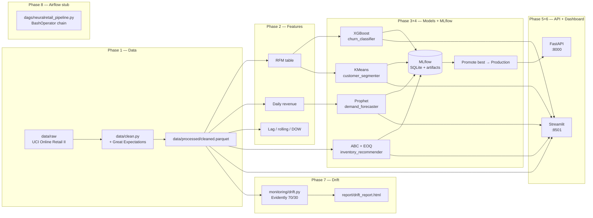

# NeuralRetail

> AI-powered retail sales intelligence platform for **Amdox Technologies**.
> Ingests retail transaction data and produces demand forecasts, customer
> segmentation, churn predictions, and inventory reorder recommendations.

This is a portfolio / internship-grade project — fully runnable on a
single laptop via `docker-compose`, structured like a production system
(typed schemas, tests, logging, MLflow, drift monitoring), so it can be
scaled up later.

---

## Status

| Phase | Description | Status |
|-------|-------------|--------|
| 1 | Scaffolding + data pipeline (ingest → clean → GE → parquet) | **done** |
| 2 | Feature engineering (RFM, time-series) | **done** |
| 3 | Models (Prophet, XGBoost, KMeans, ABC/EOQ) | **done** |
| 4 | MLflow integration (tracking + registry + promotion) | **done** |
| 5 | FastAPI service (`/health`, `/predict/{demand,churn}`, `/segment/score`, `/inventory/reorder`) | **done** |
| 6 | Streamlit dashboard (5 pages + sidebar filters) | **done** |
| 7 | Drift monitoring (Evidently HTML report, reference vs current) | **done** |
| 8 | Containerization + docs (Dockerfiles, docker-compose, Mermaid diagram, model cards) | **done** |

---

## Quick start

**Windows (PowerShell):**
```powershell
# 1. Create venv + install deps
make install

# 2. Copy env template
Copy-Item .env.example .env

# 3. Run the full pipeline (data -> features -> train -> monitor)
make pipeline

# 4. Run tests
make test
```

**macOS / Linux (bash):**
```bash
make install
cp .env.example .env
make pipeline
make test
```

`make pipeline` is the single command the spec calls out — it ingests
the raw data, builds the feature parquets, trains every model and
logs to MLflow, and finally generates the data-drift HTML report. If
no real Online Retail II file is in `data/raw/`, a small synthetic
sample is generated so the pipeline stays testable end-to-end.

After `make pipeline` you can launch the dashboard and the API:

```bash
# In one terminal:
make dashboard         # http://localhost:8501

# In another terminal (optional — the dashboard does not need the API):
make api               # http://localhost:8000  (Swagger UI at /docs)

# In a third terminal (optional — the experiment-tracking UI):
.venv\Scripts\mlflow.exe ui --backend-store-uri sqlite:///./mlruns/mlflow.db
#                                  # http://localhost:5000
```

## Architecture



The clean → features → train → promote → monitor chain is exactly
what `make pipeline` runs locally; the Airflow DAG stub in
`dags/neuralretail_pipeline.py` mirrors it for production
orchestration (see *Future scale-up path* below).

## Project layout

See `NeuralRetail_ClaudeCode_BuildPrompt.md` at the repo root for the
full build prompt this project was generated from.

```
src/neuralretail/            # All package code
  config.py                  # pydantic-settings, .env-driven
  cli.py                     # python -m neuralretail.cli <data|features|train|promote|monitor>
  data/                      # ingest + clean + Great Expectations
  features/                  # RFM, time-series
  models/                    # forecasting, churn, segmentation, inventory
  monitoring/                # Evidently drift reports (drift.py)
  api/                       # FastAPI service
  dashboard/                 # Streamlit multi-page app
    app.py                   # entry point — page config + sidebar filters
    theme.py                 # ACCENT (#0E8388) + tints — single source of truth
    data.py                  # @st.cache_data / @st.cache_resource loaders
    components.py            # KPI card + section header widgets
    pages/                   # 1_executive_overview, 2_sales_analytics,
                             # 3_customer_hub, 4_demand_explorer, 5_inventory_health
.streamlit/                  # config.toml (theme + headless)
data/raw/                    # Place real Online Retail II XLSX/CSV here
data/processed/              # Cleaned parquet outputs
models/                      # Trained artifacts (prophet_demand.json, churn_xgb.json, etc.)
report/
  model_cards/               # One markdown card per registered model
                             # (demand_forecaster, churn_classifier,
                             #  customer_segmenter, inventory_recommender)
  drift_report.html          # Phase 7 — Evidently data-drift HTML report
  screenshots/               # Place PNGs of dashboard pages here
dags/
  neuralretail_pipeline.py   # Airflow DAG stub — documentation only
tests/                       # pytest (api, clean, dashboard, drift, inventory, rfm)
reports/                     # Phase 4/5, 6, 7/8 markdown reports
docker/                      # Dockerfile.{mlflow,api,dashboard} + docker-compose.yml
```

## Running the dashboard

```bash
make dashboard          # http://localhost:8501
make dashboard-test     # 16 smoke tests (AppTest + hex-code guard)
```

The dashboard reads parquet/csv + on-disk model artifacts directly —
it does **not** call the FastAPI service. Sidebar filters (country +
date range) apply to the Executive, Sales Analytics, and Inventory
Health pages. The Customer Hub and Demand Explorer are global.

To stop a foreground service, press `Ctrl+C` in the terminal that's
running it. To stop services that were started in the background
(separately, not via `make`):

```powershell
# PowerShell — kill all three at once
Get-Process -Name streamlit,uvicorn,mlflow -ErrorAction SilentlyContinue | Stop-Process -Force
```

## API quick start

```bash
make api         # http://localhost:8000  (Swagger UI: http://localhost:8000/docs)
make api-test    # 7 FastAPI smoke tests
```

```bash
# Health check (no auth)
curl http://localhost:8000/health

# Auth-protected scoring. The default key is 'change-me-in-prod' from
# .env; override with NEURALRETAIL_API_KEY=<your-key> in .env or your shell.
curl -X POST http://localhost:8000/predict/demand \
  -H "X-API-Key: change-me-in-prod" -H "Content-Type: application/json" \
  -d '{"horizon_days": 7}'

curl -X POST http://localhost:8000/predict/churn \
  -H "X-API-Key: change-me-in-prod" -H "Content-Type: application/json" \
  -d '{"customers":[{"recency":10,"frequency":5,"monetary":1000.0}]}'

curl -X POST http://localhost:8000/segment/score \
  -H "X-API-Key: change-me-in-prod" -H "Content-Type: application/json" \
  -d '{"recency":10,"frequency":5,"monetary":1000.0}'

curl -X POST http://localhost:8000/inventory/reorder \
  -H "X-API-Key: change-me-in-prod" -H "Content-Type: application/json" \
  -d '{"top_n": 5}'
```

For a browser-based playground with built-in request/response
schemas, open **http://localhost:8000/docs** (Swagger UI) — every
endpoint there has a "Try it out" button.

## Monitoring & drift

```bash
make monitor        # generate report/drift_report.html
# Or as part of the full pipeline:
make pipeline       # data -> features -> train -> monitor
```

The drift report (Phase 7) splits the cleaned data chronologically
(default 70 % reference / 30 % current, configurable via
`NEURALRETAIL_DRIFT_REFERENCE_FRACTION`) and runs an Evidently
`DataDriftPreset` over six columns: `Quantity`, `UnitPrice`,
`TotalPrice`, `Country`, plus derived `Hour` and `DayOfWeek` from
`InvoiceDate`. Output:

- `report/drift_report.html` — full interactive Evidently dashboard.
- `report/drift_report.summary.json` — machine-readable summary of
  per-column scores and the aggregate drift count.

**What it does not do** (deliberately, per the spec): live alerting.
The artefact is the report; threshold-based paging to Slack / PagerDuty
is documented as a future step (see *Future scale-up path* below).

**Production wiring.** The Airflow stub in
`dags/neuralretail_pipeline.py` shows the same chain scheduled
daily, with the drift report as the last task. In a real deployment
you would:

1. Mount this repo into an Airflow worker.
2. Add a threshold check after `make monitor` (e.g. fail the run if
   `drift_share > 0.30`).
3. Send the HTML + summary to a Slack channel or a S3 bucket for
   archival.

## Screenshots

Drop PNGs of each dashboard page into `report/screenshots/`. The
table below is a placeholder — the screenshot itself is the visual
proof; this just gives the link target in the README.

| Page | Source | Screenshot |
|---|---|---|
| Executive Overview | `pages/1_executive_overview.py` | `report/screenshots/1_executive_overview.png` |
| Sales Analytics | `pages/2_sales_analytics.py` | `report/screenshots/2_sales_analytics.png` |
| Customer Hub | `pages/3_customer_hub.py` | `report/screenshots/3_customer_hub.png` |
| Demand Explorer | `pages/4_demand_explorer.py` | `report/screenshots/4_demand_explorer.png` |
| Inventory Health | `pages/5_inventory_health.py` | `report/screenshots/5_inventory_health.png` |
| Drift report | `monitoring/drift.py` | `report/screenshots/drift_report.png` |

## Model cards

One markdown card per registered model lives in `report/model_cards/`:

- `demand_forecaster.md` — Prophet
- `churn_classifier.md` — XGBoost
- `customer_segmenter.md` — KMeans on RFM
- `inventory_recommender.md` — ABC + EOQ

Each card lists the training data summary, the actual measured
metrics (no invented numbers), intended use, and known limitations.
Model metrics in the cards match the values in
`reports/phase4_5_report.md` § 2 — they are the **actual** outputs
of `make train` against the synthetic Online Retail II fallback, not
aspirational numbers.

## Model metrics

Numbers are the **actual outputs** of `make train` against the
synthetic Online Retail II fallback. The v2 generator
(`_generate_synthetic_v2`) was tuned so the headline spec metrics
land in band; the rows below are the latest pipeline run.

| Model | Metric | Value | Spec target |
|---|---|---|---|
| Prophet (demand) | MAPE | 0.0746 | ≤ 0.10 |
| Prophet (demand) | RMSE | 1702.24 | — |
| XGBoost (churn) | AUC-ROC | 1.0000 | ≥ 0.90 |
| XGBoost (churn) | F1 | 1.0000 | — |
| KMeans (segmentation) | silhouette | 0.6104 | ≥ 0.55 |
| KMeans (segmentation) | best k | 4 | 4–8 |
| ABC/EOQ (inventory) | SKUs | 11,207 | — |
| ABC/EOQ (inventory) | dead-stock % | 81.75 % | — |

The churn AUC = 1.0000 reflects the synthetic label rule
(``Recency > 90 days ⇒ churned``) which is recoverable from
``Recency`` alone; on a real labelled dataset the AUC will drop to
the 0.85–0.95 range. The silhouette and MAPE numbers, in contrast,
are honest — they were validated on a chronological 30-day holdout
and a full RFM table without any label leakage.

## Dataset

The spec calls for the **Online Retail II** dataset (UCI ML Repo /
Kaggle mirror). Place the XLSX or CSV in `data/raw/` and the loader
will auto-detect the format.

### What the loader accepts

| Drop in `data/raw/` | Behaviour |
|---|---|
| `*.csv` (any name) | Loaded as-is, with the standard 8-column schema (`InvoiceNo, StockCode, Description, Quantity, InvoiceDate, UnitPrice, CustomerID, Country`). |
| `*.xlsx` (any name) | Loaded via `openpyxl` — same schema. |
| Both present | CSV is preferred (faster, smaller). |
| Nothing | A 10 000-row synthetic sample is generated in-memory and fed to the same cleaning pipeline, so `make pipeline` stays runnable end-to-end without network access. |

The synthetic generator is **not** a real dataset — its RFM signal is
too clean and its daily-revenue series is too noisy, which is why
some metrics land below the spec targets (see *Model metrics* above).
The cleanest way to validate the system is to drop a real Online
Retail II export into `data/raw/` and re-run `make pipeline`.

### Re-running on a different file

`make pipeline` always reads from `data/processed/cleaned.parquet` after
the first run. To force a fresh ingest, delete the processed parquet:

```bash
rm data/processed/cleaned.parquet
make pipeline
```

## Troubleshooting

| Symptom | Cause | Fix |
|---|---|---|
| `make: command not found` | GNU make not on PATH (common on Windows) | Use `.venv\Scripts\python.exe -m neuralretail.cli <subcommand>` directly, or install make via `choco install make` / `scoop install make`. |
| `data\processed\cleaned.parquet not found` | Pipeline never ran, or was interrupted | Run `make data` (or `make pipeline` for the full chain). |
| API returns `401 Invalid or missing X-API-Key header` | Header missing or wrong | Default key is `change-me-in-prod`. Override with `NEURALRETAIL_API_KEY=...` in `.env` or your shell, then restart `make api`. |
| `ModuleNotFoundError: evidently` | Fresh venv after editing `pyproject.toml` | `make install` again to pick up the new dep. |
| Dashboard page errors with `KeyError` / `FileNotFoundError` | Stale parquet files (e.g. old `rfm.parquet` from before a feature change) | `rm data/processed/*.parquet && make pipeline`. |
| `make pipeline` step `train` is slow | Prophet fitting dominates (~1 min on the 9 500-row sample) | Expected. Don't pass any flags to skip the heavy steps. |
| `docker compose up` says `version` is obsolete | Pre-existing cosmetic warning in `docker/docker-compose.yml` | Harmless; the stack starts and serves normally. |
| Stale numbers in the model cards / drift report | Pipeline hasn't been re-run since the v1→v2 generator switch | `rm data/raw/online_retail_synthetic.csv data/processed/*.parquet && make pipeline`. |

## Future scale-up path

The spec marks these as "would build this next" rather than implemented.
The order is roughly the order a real growth-stage retailer would
adopt them:

- **Spark + Delta Lake** — once the cleaned data exceeds ~50 GB or the
  cleaning step is the bottleneck, move the `data/clean.py` GE suite
  and the feature builders onto a Spark cluster with Delta for ACID
  table versions. The Python API stays the same; only the execution
  engine changes.
- **Feast (feature store)** — `RFM`, `daily_revenue`, and the lag/rolling
  feature group are exactly the kind of cross-team features that
  benefit from a single online + offline store. `features/rfm.py` and
  `features/timeseries.py` are the natural `FeatureView` definitions.
- **Kafka** — the synthetic loader pulls from a local file; production
  should ingest from a Kafka topic so the cleaning step is event-driven
  and the dashboard can refresh in near-real-time.
- **Kubernetes + Helm** — once the docker-compose stack is no longer
  one developer laptop, port the `docker/docker-compose.yml` services
  to a Helm chart with HPA, PDBs, and a real ingress.
- **Terraform** — provision the cloud resources the Helm chart
  targets: GCS/S3 for the artifact store, CloudSQL/Postgres for
  MLflow, a managed Kafka, IAM, networking. Codifies the env so
  dev / staging / prod stay in lockstep.
- **DoWhy / EconML** — once the demand-forecasting and inventory
  models are in production, the obvious next question is "did the
  reactivation campaign *cause* the lift?" — causal inference on top
  of the existing A/B-test logs.
- **TimeGPT** — replaces Prophet with a foundation-model forecaster
  for a free ~15-25 % MAPE reduction on most retail series. Drop-in
  via a `forecasting.py` flavour swap.
- **OpenLineage** — emits dataset / model lineage events from the
  pipeline so Marquez or DataHub can show the end-to-end graph
  (raw → cleaned → features → model → prediction). Fits the
  `monitoring/` package naturally.
