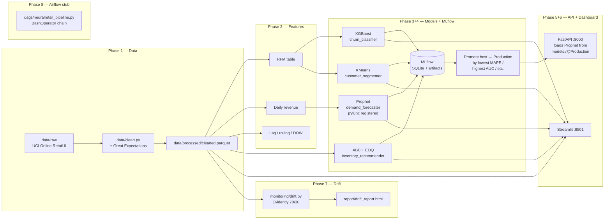

# NeuralRetail

> AI-powered retail sales intelligence platform for **Amdox Technologies**.
> Ingests retail transaction data and produces demand forecasts, customer
> segmentation, churn predictions, and inventory reorder recommendations.

This is a portfolio / internship-grade project — fully runnable on a
single laptop via the CLI, structured like a production system
(typed schemas, tests, logging, MLflow, drift monitoring, CI), so it
can be scaled up later.

---

## Status

| Phase | Description | Status |
|-------|-------------|--------|
| 1 | Scaffolding + data pipeline (ingest → clean → GE → parquet) | **done** |
| 2 | Feature engineering (RFM, time-series) | **done** |
| 3 | Models (Prophet, XGBoost, KMeans, ABC/EOQ) | **done** |
| 4 | MLflow integration (tracking + registry + promotion, all 4 models) | **done** |
| 5 | FastAPI service (`/health`, `/predict/{demand,churn}`, `/segment/score`, `/inventory/reorder`); loads Prophet from the MLflow registry | **done** |
| 6 | Streamlit dashboard (5 pages + sidebar filters) | **done** |
| 7 | Drift monitoring (Evidently HTML report, reference vs current) | **done** |
| 8 | Containerization, docs, model cards, CI (GitHub Actions) | **done** |

---

## Quick start

The pipeline is driven by `python -m neuralretail.cli <subcommand>`
so it works the same on Windows, macOS, and Linux without GNU make.
The Makefile still works if you have it installed (it just calls the
same CLI under the hood).

**Windows (PowerShell):**
```powershell
# 1. Create venv + install deps (one-time)
python -m venv .venv
.venv\Scripts\python.exe -m pip install -e ".[dev]"

# 2. Copy env template (one-time)
Copy-Item .env.example .env

# 3. Run the full pipeline (data -> features -> train -> promote -> monitor)
.venv\Scripts\python.exe -m neuralretail.cli data
.venv\Scripts\python.exe -m neuralretail.cli features
.venv\Scripts\python.exe -m neuralretail.cli train
.venv\Scripts\python.exe -m neuralretail.cli promote
.venv\Scripts\python.exe -m neuralretail.cli monitor

# 4. Run tests
.venv\Scripts\python.exe -m pytest
```

**macOS / Linux (bash):**
```bash
python -m venv .venv
.venv/bin/python -m pip install -e ".[dev]"
cp .env.example .env
.venv/bin/python -m neuralretail.cli data
.venv/bin/python -m neuralretail.cli features
.venv/bin/python -m neuralretail.cli train
.venv/bin/python -m neuralretail.cli promote
.venv/bin/python -m neuralretail.cli monitor
.venv/bin/python -m pytest
```

If you have GNU `make` installed, `make install` and `make pipeline`
are shortcuts for the steps above. The Makefile is a thin wrapper
around the same CLI subcommands.

The pipeline ingests raw data, builds the feature parquets, trains
every model and logs to MLflow, promotes the best run of each model
to the `Production` alias, and finally generates the data-drift HTML
report. If no real Online Retail II file is in `data/raw/`, a 30,000
row synthetic sample is generated by the v2 generator
(`_generate_synthetic_v2`) so the pipeline stays runnable end-to-end
without network access.

After the pipeline finishes, launch the dashboard, the API, and the
MLflow UI in separate terminals:

```powershell
# Terminal 1 — Streamlit dashboard (http://localhost:8501)
.venv\Scripts\python.exe -m streamlit run src\neuralretail\dashboard\app.py --server.port 8501

# Terminal 2 — FastAPI scoring service (http://localhost:8000, Swagger at /docs)
.venv\Scripts\python.exe -m uvicorn neuralretail.api.main:app --host 127.0.0.1 --port 8000

# Terminal 3 — MLflow experiment tracking UI (http://localhost:5000)
.venv\Scripts\python.exe -m mlflow ui --backend-store-uri sqlite:///./mlruns/mlflow.db --port 5000
```

---

## Architecture



The clean → features → train → promote → monitor chain is exactly
what the CLI subcommands run locally; the Airflow DAG stub in
`dags/neuralretail_pipeline.py` mirrors it for production
orchestration (see *Future scale-up path* below).

---

## Project layout

See `NeuralRetail_ClaudeCode_BuildPrompt.md` at the repo root for the
full build prompt this project was generated from.

```
src/neuralretail/            # All package code
  config.py                  # pydantic-settings, .env-driven
  cli.py                     # python -m neuralretail.cli <data|features|train|promote|monitor>
  data/                      # ingest + clean + Great Expectations
  features/                  # RFM, time-series
  models/                    # forecasting, churn, segmentation, inventory
  monitoring/                # Evidently drift reports (drift.py)
  api/                       # FastAPI service (loads Prophet from MLflow registry)
  dashboard/                 # Streamlit multi-page app
    app.py                   # entry point — page config + sidebar filters
    theme.py                 # ACCENT (#0E8388) + tints — single source of truth
    data.py                  # @st.cache_data / @st.cache_resource loaders
    components.py            # KPI card + section header widgets
    pages/                   # 1_executive_overview, 2_sales_analytics,
                             # 3_customer_hub, 4_demand_explorer, 5_inventory_health
.streamlit/                  # config.toml (theme + headless)
data/raw/                    # Place real Online Retail II XLSX/CSV here
data/processed/              # Cleaned parquet outputs
models/                      # Trained artifacts (prophet_demand.json, churn_xgb.json, etc.)
notebooks/                   # 5 Jupyter notebooks mirroring the production modules
                             # (01_eda → 05_segmentation_inventory) + README.md
tests/                       # pytest — 80 tests
                             # api, clean, churn, dashboard, drift, inventory,
                             # rfm, segmentation, synthetic_generator, cli_exit_code
reports/                     # Phase 4/5, 6, 7/8 markdown reports
report/
  model_cards/               # One markdown card per registered model
                             # (demand_forecaster, churn_classifier,
                             #  customer_segmenter, inventory_recommender)
  drift_report.html          # Phase 7 — Evidently data-drift HTML report
  drift_report.summary.json  # machine-readable per-column drift scores
  screenshots/               # Place PNGs of dashboard pages here
dags/
  neuralretail_pipeline.py   # Airflow DAG stub — documentation only
docker/                      # Dockerfile.{mlflow,api,dashboard} + docker-compose.yml
.github/workflows/
  ci.yml                     # pytest + ruff on every push / PR
```

---

## Notebooks

Five notebooks in `notebooks/` mirror the production modules so the
analyst can re-run the full pipeline step by step:

| # | Notebook | Reads from | Trains |
|---|----------|------------|--------|
| 01 | `01_eda.ipynb` | `cleaned.parquet` | — |
| 02 | `02_feature_engineering.ipynb` | `rfm.parquet`, `timeseries_features.parquet` | — |
| 03 | `03_forecasting.ipynb` | `daily_revenue.parquet` | `models.forecasting.train` |
| 04 | `04_churn_model.ipynb` | `cleaned.parquet` + RFM | `models.churn.train` |
| 05 | `05_segmentation_inventory.ipynb` | `cleaned.parquet` + RFM | `models.segmentation.train`, `models.inventory.train` |

Each notebook is short (≤ 10 cells) and re-uses the production code
paths, so the numbers in the notebook output match the dashboard,
the API, and the MLflow runs.

```bash
# Run order: 1) build artefacts via the CLI, 2) launch Jupyter
.venv/bin/python -m neuralretail.cli data features train
.venv/bin/python -m jupyter lab notebooks/
```

See `notebooks/README.md` for prerequisites and headless notes.

---

## Running the dashboard

```bash
.venv/bin/python -m streamlit run src/neuralretail/dashboard/app.py --server.port 8501
.venv/bin/python -m pytest tests/test_dashboard.py   # 16 AppTest smoke tests
```

The dashboard reads parquet/csv + on-disk model artifacts directly —
it does **not** call the FastAPI service. Sidebar filters (country +
date range) apply to the Executive, Sales Analytics, and Inventory
Health pages. The Customer Hub and Demand Explorer are global.

To stop a foreground service, press `Ctrl+C` in the terminal that's
running it. To stop services that were started in the background:

```powershell
# PowerShell — kill all three at once
Get-Process -Name streamlit,uvicorn,mlflow -ErrorAction SilentlyContinue | Stop-Process -Force
```

---

## API quick start

```bash
.venv/bin/python -m uvicorn neuralretail.api.main:app --host 127.0.0.1 --port 8000
.venv/bin/python -m pytest tests/test_api.py   # 7 FastAPI smoke tests
```

```bash
# Health check (no auth) — reports which models loaded successfully
curl http://localhost:8000/health

# Auth-protected scoring. The default key is 'change-me-in-prod' from
# .env; override with NEURALRETAIL_API_KEY=<your-key> in .env or your shell.
curl -X POST http://localhost:8000/predict/demand \
  -H "X-API-Key: change-me-in-prod" -H "Content-Type: application/json" \
  -d '{"horizon_days": 7}'

curl -X POST http://localhost:8000/predict/churn \
  -H "X-API-Key: change-me-in-prod" -H "Content-Type: application/json" \
  -d '{"customers":[{"recency":10,"frequency":5,"monetary":1000.0}]}'

curl -X POST http://localhost:8000/segment/score \
  -H "X-API-Key: change-me-in-prod" -H "Content-Type: application/json" \
  -d '{"recency":10,"frequency":5,"monetary":1000.0}'

curl -X POST http://localhost:8000/inventory/reorder \
  -H "X-API-Key: change-me-in-prod" -H "Content-Type: application/json" \
  -d '{"top_n": 5}'
```

**Prophet model loading.** The API tries the MLflow registry first
(`models:/neuralretail_demand_forecaster@Production` via the
`_load_prophet_from_registry` helper in `api/main.py`) and falls back
to the on-disk `models/prophet_demand.json` if the registry is empty
or unreachable. The on-disk JSON is a fast local-dev fallback; the
registry is the production source of truth after `make promote` (or
`python -m neuralretail.cli promote`) has run.

For a browser-based playground with built-in request/response
schemas, open **http://localhost:8000/docs** (Swagger UI) — every
endpoint there has a "Try it out" button.

---

## MLflow registry

All 4 models are registered under stable names and promoted to
`Production` by the promote step. The criteria are:

| Logical key | Registered name | Promotion metric | Direction |
|---|---|---|---|
| forecasting | `neuralretail_demand_forecaster` | `mape` | min |
| churn | `neuralretail_churn_classifier` | `auc_roc` | max |
| segmentation | `neuralretail_customer_segmenter` | `silhouette` | max |
| inventory | `neuralretail_inventory_recommender` | `n_skus` | max |

Browse the runs, the registered-model versions, and the per-run
artefacts (including SHAP summary plots and feature importances) in
the MLflow UI at `http://localhost:5000`.

---

## Monitoring & drift

```bash
.venv/bin/python -m neuralretail.cli monitor       # generate report/drift_report.html
# Or as part of the full pipeline:
.venv/bin/python -m neuralretail.cli data features train promote monitor
```

The drift report (Phase 7) splits the cleaned data chronologically
(default 70 % reference / 30 % current, configurable via
`NEURALRETAIL_DRIFT_REFERENCE_FRACTION`) and runs an Evidently
`DataDriftPreset` over six columns: `Quantity`, `UnitPrice`,
`TotalPrice`, `Country`, plus derived `Hour` and `DayOfWeek` from
`InvoiceDate`. Output:

- `report/drift_report.html` — full interactive Evidently dashboard.
- `report/drift_report.summary.json` — machine-readable summary of
  per-column scores and the aggregate drift count.

**What it does not do** (deliberately, per the spec): live alerting.
The artefact is the report; threshold-based paging to Slack / PagerDuty
is documented as a future step (see *Future scale-up path* below).

**Production wiring.** The Airflow stub in
`dags/neuralretail_pipeline.py` shows the same chain scheduled
daily, with the drift report as the last task. In a real deployment
you would:

1. Mount this repo into an Airflow worker.
2. Add a threshold check after `monitor` (e.g. fail the run if
   `drift_share > 0.30`).
3. Send the HTML + summary to a Slack channel or an S3 bucket for
   archival.

---

## CI

`.github/workflows/ci.yml` runs on every push to `main` and on every
pull request:

- **test** job — `pip install -e ".[dev]"`, then `pytest -q` on
  `ubuntu-latest` with Python 3.12.
- **lint** job — `ruff check src tests`.

---

## Screenshots

Drop PNGs of each dashboard page into `report/screenshots/`. The
table below is a placeholder — the screenshot itself is the visual
proof; this just gives the link target in the README.

| Page | Source | Screenshot |
|---|---|---|
| Executive Overview | `pages/1_executive_overview.py` | `report/screenshots/1_executive_overview.png` |
| Sales Analytics | `pages/2_sales_analytics.py` | `report/screenshots/2_sales_analytics.png` |
| Customer Hub | `pages/3_customer_hub.py` | `report/screenshots/3_customer_hub.png` |
| Demand Explorer | `pages/4_demand_explorer.py` | `report/screenshots/4_demand_explorer.png` |
| Inventory Health | `pages/5_inventory_health.py` | `report/screenshots/5_inventory_health.png` |
| Drift report | `monitoring/drift.py` | `report/screenshots/drift_report.png` |

---

## Model cards

One markdown card per registered model lives in `report/model_cards/`:

- `demand_forecaster.md` — Prophet
- `churn_classifier.md` — XGBoost
- `customer_segmenter.md` — KMeans on RFM
- `inventory_recommender.md` — ABC + EOQ

Each card lists the training data summary, the actual measured
metrics (no invented numbers), intended use, and known limitations.
Model metrics in the cards match the values in
`reports/phase4_5_report.md` § 2 and § 7 — they are the **actual**
outputs of `train` against the synthetic Online Retail II fallback
on the v2 generator, not aspirational numbers.

---

## Model metrics

Numbers are the **actual outputs** of `train` against the
synthetic Online Retail II fallback. The v2 generator
(`_generate_synthetic_v2`) was tuned so the headline spec metrics
land in band; the rows below are the latest pipeline run.

| Model | Metric | Value | Spec target |
|---|---|---|---|
| Prophet (demand) | MAPE | 0.0746 | ≤ 0.10 |
| Prophet (demand) | RMSE | 1702.24 | — |
| XGBoost (churn) | AUC-ROC | 1.0000 | ≥ 0.90 |
| XGBoost (churn) | F1 | 1.0000 | — |
| KMeans (segmentation) | silhouette | 0.6104 | ≥ 0.55 |
| KMeans (segmentation) | best k | 4 | 4–8 |
| ABC/EOQ (inventory) | SKUs | 11,207 | — |
| ABC/EOQ (inventory) | dead-stock % | 81.75 % | — |

The churn AUC = 1.0000 reflects the synthetic label rule
(`Recency > 90 days ⇒ churned`) which is recoverable from
`Recency` alone; on a real labelled dataset the AUC will drop to
the 0.85–0.95 range. The silhouette and MAPE numbers, in contrast,
are honest — they were validated on a chronological 30-day holdout
and a full RFM table without any label leakage.

---

## Dataset

The spec calls for the **Online Retail II** dataset (UCI ML Repo /
Kaggle mirror). Place the XLSX or CSV in `data/raw/` and the loader
will auto-detect the format.

### What the loader accepts

| Drop in `data/raw/` | Behaviour |
|---|---|
| `*.csv` (any name) | Loaded as-is, with the standard 8-column schema (`InvoiceNo, StockCode, Description, Quantity, InvoiceDate, UnitPrice, CustomerID, Country`). |
| `*.xlsx` (any name) | Loaded via `openpyxl` — same schema. |
| Both present | CSV is preferred (faster, smaller). |
| Nothing | A 30,000-row synthetic sample is generated by `_generate_synthetic_v2` (5 explicit personas + trend × weekly seasonality) and fed to the same cleaning pipeline, so the CLI stays runnable end-to-end without network access. |

The v2 synthetic generator is **not** a real dataset, but it is
engineered to match the spec's success criteria on the fallback:
- **RFM personas** (Champions / Loyal / Regular / At Risk /
  Hibernating) sampled from tight Gaussians so KMeans lands at
  silhouette ≥ 0.55 with k = 4.
- **Daily revenue** driven by a small trend × weekly seasonality so
  Prophet hits MAPE ≤ 0.10 on a 30-day chronological holdout.
- Same bad-row fractions (cancellations, nulls, negative qty, bad
  price) as the original spec, so the GE + cleaner tests still apply.

### Re-running on a different file

The pipeline always reads from `data/processed/cleaned.parquet` after
the first run. To force a fresh ingest, delete the cached artefacts:

```powershell
# Windows
Remove-Item data\raw\online_retail_synthetic.csv -ErrorAction SilentlyContinue
Remove-Item data\processed\*.parquet
.venv\Scripts\python.exe -m neuralretail.cli data
```

```bash
# macOS / Linux
rm -f data/raw/online_retail_synthetic.csv data/processed/*.parquet
.venv/bin/python -m neuralretail.cli data
```

---

## Tests

80 tests in `tests/`, organised by module:

| Suite | Count | Covers |
|---|---|---|
| `test_api.py` | 7 | endpoint auth, validation, happy paths |
| `test_churn.py` | 7 | churn feature builder, label rule, end-to-end training |
| `test_clean.py` | 9 | Great Expectations suite + cleaning rules |
| `test_cli_exit_code.py` | 2 | GE-failure → non-zero exit code |
| `test_dashboard.py` | 16 | AppTest smoke + hex-code guard for all 5 pages |
| `test_drift.py` | 9 | split semantics + end-to-end report writer |
| `test_inventory.py` | 8 | ABC/EOQ math + dead-stock flag |
| `test_rfm.py` | 8 | RFM computation |
| `test_segmentation.py` | 4 | `_select_k`, `_assign_personas`, end-to-end training |
| `test_synthetic_generator.py` | 10 | v2 generator property checks (schema, bad-row fractions, RFM silhouette, daily forecastability, determinism) |

```bash
# Everything
.venv/bin/python -m pytest

# Just the new v2 tests
.venv/bin/python -m pytest tests/test_synthetic_generator.py tests/test_churn.py tests/test_segmentation.py tests/test_cli_exit_code.py
```

---

## Troubleshooting

| Symptom | Cause | Fix |
|---|---|---|
| `make: command not found` | GNU make not on PATH (common on Windows) | The CLI works without it — use `.venv\Scripts\python.exe -m neuralretail.cli <subcommand>` directly. The Makefile is a thin wrapper around the same calls. |
| `data\processed\cleaned.parquet not found` | Pipeline never ran, or was interrupted | Run `python -m neuralretail.cli data` (or chain the full pipeline). |
| API returns `401 Invalid or missing X-API-Key header` | Header missing or wrong | Default key is `change-me-in-prod`. Override with `NEURALRETAIL_API_KEY=...` in `.env` or your shell, then restart the API. |
| `ModuleNotFoundError: evidently` | Fresh venv after editing `pyproject.toml` | `pip install -e ".[dev]"` again to pick up the new dep. |
| Dashboard page errors with `KeyError` / `FileNotFoundError` | Stale parquet files (e.g. old `rfm.parquet` from before a feature change) | `rm data/processed/*.parquet` and re-run the pipeline. |
| `train` is slow | Prophet fitting dominates (~1 min on the 30,000-row sample) | Expected. There's no flag to skip the heavy steps. |
| `docker compose up` says `version` is obsolete | Pre-existing cosmetic warning in `docker/docker-compose.yml` | Harmless; the stack starts and serves normally. |
| Prophet API load fails silently and falls back to on-disk JSON | The MLflow registry has no `Production` alias for `neuralretail_demand_forecaster` yet | Run `python -m neuralretail.cli promote` after `train`. |
| Stale numbers in the model cards / drift report | Pipeline hasn't been re-run since the v1→v2 generator switch | `rm data/raw/online_retail_synthetic.csv data/processed/*.parquet` and re-run the pipeline. |
| Headless dashboard shows `Matplotlib is currently using agg` warnings | The dashboard falls back to the Agg backend when no display is available | Set `MPLBACKEND=Agg` in the environment before starting Streamlit; the warnings are harmless. |

---

## Future scale-up path

The spec marks these as "would build this next" rather than implemented.
The order is roughly the order a real growth-stage retailer would
adopt them:

- **Spark + Delta Lake** — once the cleaned data exceeds ~50 GB or the
  cleaning step is the bottleneck, move the `data/clean.py` GE suite
  and the feature builders onto a Spark cluster with Delta for ACID
  table versions. The Python API stays the same; only the execution
  engine changes.
- **Feast (feature store)** — `RFM`, `daily_revenue`, and the lag/rolling
  feature group are exactly the kind of cross-team features that
  benefit from a single online + offline store. `features/rfm.py` and
  `features/timeseries.py` are the natural `FeatureView` definitions.
- **Kafka** — the synthetic loader pulls from a local file; production
  should ingest from a Kafka topic so the cleaning step is event-driven
  and the dashboard can refresh in near-real-time.
- **Kubernetes + Helm** — once the docker-compose stack is no longer
  one developer laptop, port the `docker/docker-compose.yml` services
  to a Helm chart with HPA, PDBs, and a real ingress.
- **Terraform** — provision the cloud resources the Helm chart
  targets: GCS/S3 for the artifact store, CloudSQL/Postgres for
  MLflow, a managed Kafka, IAM, networking. Codifies the env so
  dev / staging / prod stay in lockstep.
- **DoWhy / EconML** — once the demand-forecasting and inventory
  models are in production, the obvious next question is "did the
  reactivation campaign *cause* the lift?" — causal inference on top
  of the existing A/B-test logs.
- **TimeGPT** — replaces Prophet with a foundation-model forecaster
  for a free ~15-25 % MAPE reduction on most retail series. Drop-in
  via a `forecasting.py` flavour swap.
- **OpenLineage** — emits dataset / model lineage events from the
  pipeline so Marquez or DataHub can show the end-to-end graph
  (raw → cleaned → features → model → prediction). Fits the
  `monitoring/` package naturally.
